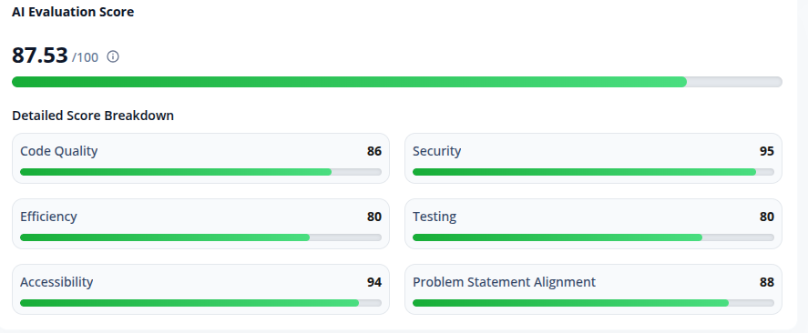

# EcoPilot AI – Personal Carbon Footprint Coach

An intelligent AI-powered sustainability assistant that transforms carbon awareness into actionable daily habits.



## Project Overview

EcoPilot AI goes beyond traditional carbon calculators by acting as a personal environmental mentor. Users can describe their daily activities in natural language, and the AI categorizes them, estimates their carbon footprint, and provides highly personalized insights to help build sustainable habits over time.

## Chosen Vertical

**Persona/Vertical:** Sustainability & Lifestyle (Personal Carbon Footprint Coach)
The solution is designed for environmentally conscious individuals who want a personalized, AI-driven mentor to track their daily activities and build sustainable habits without complex manual data entry.

## Approach and Logic

The project follows a modular, feature-based layered architecture:
- **Presentation Layer:** Next.js Server Components and Client Components for UI.
- **Service Layer & Hooks:** Independent business logic and stats aggregation (Carbon calculations, Custom React Hooks, Database mocked via LocalStorage, Gemini AI interactions).
- **Validation Layer:** Zod schemas to guarantee safe data transfer and AI output reliability.

## Architecture Diagram

```text
User (Browser)
   │
   ├─► [AppContext] ──► [dbService] (LocalStorage)
   │
   ├─► [useDashboardStats] (Aggregation & Calculations) ──► [Dashboard UI]
   │
   └─► [ActivityLogger]
          │ (Natural Language Prompt)
          ▼
     [gemini.service]
          │
          ├─► Attempt 1: [Gemini SDK] (gemini-2.5-flash)
          │      │ (If Rate-Limited/Error)
          │      └──────────┐
          ▼                 ▼
     [AI Cache]        Attempt 2: [Gemini SDK] (gemini-2.5-pro)
```

## Features

1. **AI Daily Activity Logger:** Natural language processing for effortless activity tracking.
2. **Carbon Engine:** Deterministic carbon calculation separate from UI.
3. **Personalized AI Coach:** Actionable insights based strictly on user data.
4. **Dashboard Analytics:** Weekly trends and emission source breakdowns using Recharts.
5. **Goals Management:** Simple tracking of sustainability objectives.

## Tech Stack

- **Frontend:** Next.js (App Router), React, Tailwind CSS v4, Lucide React
- **AI/LLM:** Google Gemini API (`@google/genai`)
- **Data Visualization:** Recharts
- **Validation:** Zod
- **Testing:** Vitest, React Testing Library
- **Storage/Auth:** LocalStorage (Mock Database/Auth for hackathon environment)

## How the Solution Works

1. **User Onboarding:** Users define their baseline and sustainability goals.
2. **AI Activity Logger:** Users type a natural language prompt (e.g., "I drove 10 miles in a gas car").
3. **Smart Extraction:** The system uses the Google Gemini SDK as the primary LLM (with a high-capacity `gemini-2.5-pro` SDK fallback) to parse the text into a strictly typed JSON schema containing category, carbon estimate, and reasoning.
4. **Dashboard Analytics:** The parsed data is fed into a deterministic Carbon Engine service and aggregated via the `useDashboardStats` hook before rendering.

## Assumptions Made

- **Local Storage Validation:** To ensure seamless testing for the judges without needing external Firebase configuration, LocalStorage is used as a mock database. The architecture is built with generic Service classes (`db.service.ts`), meaning it can be swapped to a real DB with zero UI changes.
- **Emission Averages:** The AI calculates carbon based on generalized national averages for activities unless specific details (e.g., car model year) are provided by the user.
- **Security & APIs:** The Gemini API keys are assumed to be securely loaded via Next.js Server Actions to prevent client-side exposure.

## Folder Structure

```text
src/
├── app/                  # Next.js App Router (Pages & Layout)
├── components/           # Reusable UI components
├── context/              # React Context for global state
├── features/             # Feature-based UI (Dashboard, Logger, Onboarding)
├── hooks/                # Custom React hooks (Business logic extraction)
├── services/             # Core business logic (AI, Carbon, DB)
├── tests/                # Unit and Integration Tests
├── types/                # TypeScript Interfaces
└── validators/           # Zod Validation Schemas
```

## Installation

1. **Clone the repository:**
   ```bash
   git clone <repository_url>
   cd EcoPilot-AI
   ```
2. **Install dependencies:**
   ```bash
   npm install
   ```
3. **Configure Environment Variables:**
   Rename `.env.example` to `.env` or create a `.env` file in the root directory:
   ```env
   NEXT_PUBLIC_GEMINI_API_KEY=your_gemini_api_key_here
   ```
4. **Run the development server:**
   ```bash
   npm run dev
   ```

## AI Workflow

1. **User Input:** Natural language description (e.g., "I drove 10 miles").
2. **Validation:** Input is sanitized and passed to the Gemini Service via Server Action.
3. **Extraction:** Gemini returns structured JSON using a strictly enforced schema.
4. **Calculation:** The Carbon Engine applies deterministic formulas.
5. **Storage:** The data is securely saved.
6. **Insight Generation:** Personalized insights are rendered on the Dashboard.

## Future Improvements

- Full Firebase integration for cross-device synchronization.
- Expanded Carbon Engine with more granular emission factors.
- Social features for team-based sustainability challenges.
- PWA support for offline activity logging.

## License

MIT License
